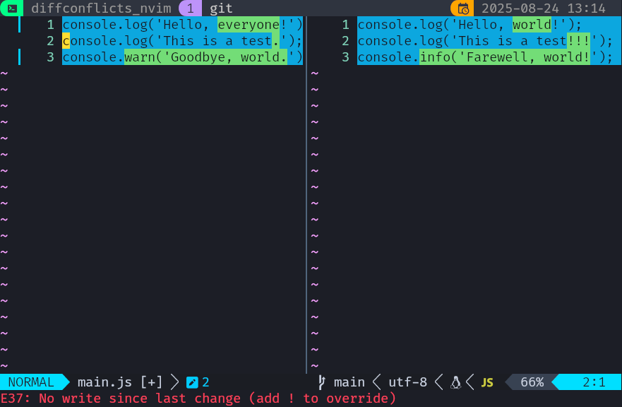

<div align="center">


# diffconflicts.nvim

[](https://github.com/mistweaverco/diffconflicts.nvim/graphs/contributors)
[](https://github.com/mistweaverco/diffconflicts.nvim/releases/latest)
[](./LICENSE)
[](https//:github.com/mistweaverco/diffconflicts.nvim/issues)
[](https://mistweaverco.com/discord)

[Requirements](#requirements) • [Installation](#installation) • [Usage](#usage)

<p></p>

A Neovim plugin for resolving merge conflicts.

Make resolving merge conflicts in Neovim a breeze.

<p></p>

</div>

## Requirements

- Neovim 0.10+
- Git 2.25+ (for `git mergetool` support)

## Installation

Use your favorite plugin manager to install `diffconflicts.nvim`.

For example, with [Lazy](https://github.com/folke/lazy.nvim):

```lua
{
  "mistweaverco/diffconflicts.nvim",
  opts = {
    -- Optional configuration
    commands = {
      -- Command to open the diff conflicts view, default is "DiffConflicts"
      -- set to nil to disable the command
      diff_conflicts = "DiffConflicts",
      -- Command to show the history of conflicts, default is "DiffConflictsShowHistory"
      -- set to nil to disable the command
      show_history = "DiffConflictsShowHistory",
      -- Command to resolve conflicts with history, default is "DiffConflictsWithHistory"
      -- set to nil to disable the command
      with_history = "DiffConflictsWithHistory",
    },
  }
}
```

Configure Git to use this plugin as a merge-tool:

```sh
git config --global merge.tool diffconflicts
git config --global mergetool.diffconflicts.cmd 'nvim -c DiffConflicts "$MERGED" "$BASE" "$LOCAL" "$REMOTE"'
git config --global mergetool.diffconflicts.trustExitCode true
git config --global mergetool.keepBackup false
```

## Usage

To resolve merge conflicts, run:

```sh
git mergetool
```

This will open the conflicting file in Neovim with the `diffconflicts.nvim` plugin enabled.
You can also manually open a file and then run the command:

```vim
:DiffConflicts
```

This will open the current file in diff mode with the conflicts highlighted.

The left side shows the resolution,
the right side shows the differences between the branches.



So all you need to do is edit the left side to resolve the conflicts.

To abort the merge, simply `:cquit`.

### Lua API

You can also use the Lua API to open the diff conflicts view:

```lua
require("diffconflicts").show()
require("diffconflicts").show_history()
require("diffconflicts").show_with_history()
```
