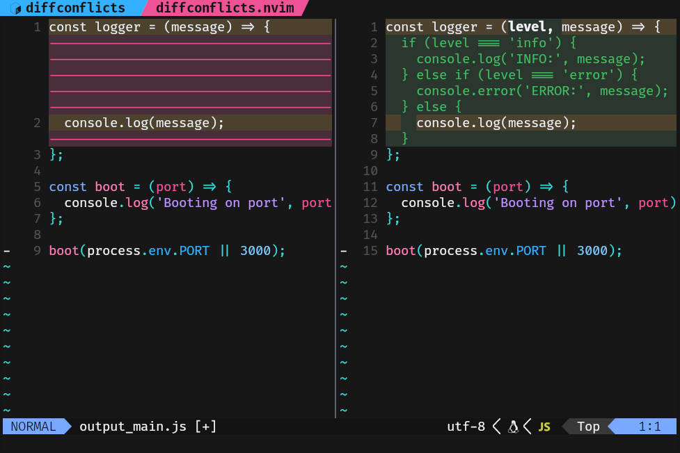

<div align="center">


# diffconflicts.nvim

[](https://github.com/mistweaverco/diffconflicts.nvim/graphs/contributors)
[](https://github.com/mistweaverco/diffconflicts.nvim/releases/latest)
[](./LICENSE)
[](https//:github.com/mistweaverco/diffconflicts.nvim/issues)
[](https://mistweaverco.com/discord)

[Requirements](#requirements) • [Installation](#installation) • [Usage](#usage)

<p></p>

A Neovim plugin for resolving merge conflicts.

Make resolving merge conflicts in Neovim a breeze.

<p></p>

</div>

## Requirements

- Neovim 0.10+
- Git 2.25+ (for `git mergetool` support)
- Jujutsu v0.18+ (optional, for `jj resolve` support)

## Installation

Use your favorite plugin manager to install `diffconflicts.nvim`.

For example, with [Lazy](https://github.com/folke/lazy.nvim):

```lua
{
  "mistweaverco/diffconflicts.nvim",
  opts = {
    -- Optional configuration
    commands = {
      -- Command to open the diff conflicts view, default is "DiffConflicts"
      -- set to nil to disable the command
      diff_conflicts = "DiffConflicts",
      -- Command to show the history of conflicts, default is "DiffConflictsShowHistory"
      -- set to nil to disable the command
      show_history = "DiffConflictsShowHistory",
      -- Command to resolve conflicts with history, default is "DiffConflictsWithHistory"
      -- set to nil to disable the command
      with_history = "DiffConflictsWithHistory",
    },
    -- Quality-of-life options
    qol = {
      -- After saving (:w), automatically close the diff view and jump to the next
      -- conflict in the file (if any).
      advance_on_save = true,
      -- If no conflicts remain after saving, quit Neovim (:qa). This is useful
      -- when running from `git mergetool` / `jj resolve`.
      quit_on_done = true,
    },
  }
}
```

Configure Git to use this plugin as a merge-tool:

```sh
git config --global merge.tool diffconflicts
git config --global mergetool.diffconflicts.cmd 'nvim -c DiffConflicts "$MERGED" "$BASE" "$LOCAL" "$REMOTE"'
git config --global mergetool.diffconflicts.trustExitCode true
git config --global mergetool.keepBackup false
```

Configure Jujutsu to use this plugin as a merge tool
(requires the default `"diff"` conflict marker style):

```toml
[merge-tools.diffconflicts]
program = "nvim"
merge-args = [
  "-c", "let g:jj_diffconflicts_marker_length=$marker_length",
  "-c", "DiffConflictsWithHistory", "$output", "$base", "$left", "$right",
]
merge-tool-edits-conflict-markers = true
```

## Usage

To resolve merge conflicts, run:

```sh
git mergetool
```

Or for Jujutsu:

```sh
jj resolve --tool diffconflicts
```

This will open the conflicting file in Neovim with the `diffconflicts.nvim` plugin enabled.
You can also manually open a file and then run the command:

```vim
:DiffConflicts
```

This will open the current file in diff mode with the conflicts highlighted.

The left side shows the resolution,
the right side shows the differences between the branches.



So all you need to do is edit the left side to resolve the conflicts.

By default, saving the file (`:w`) will automatically advance to the next conflict in the file, and if there are no conflicts left it will quit Neovim (so your merge tool can continue). You can customize this behavior via `qol.advance_on_save` and `qol.quit_on_done`.

To abort the merge, simply `:cquit`.

### Lua API

You can also use the Lua API to open the diff conflicts view:

```lua
require("diffconflicts").show()
require("diffconflicts").show_history()
require("diffconflicts").show_with_history()
```

# Real world usage

You can use the `./scripts/make-conflicts.sh`
script to create a sample repository with merge conflicts to test the plugin.

```sh
./scripts/make-conflicts.sh [jj|git] [onefile|twofiles]
```

This will create a repository in `./tmp/testrepo` with either Jujutsu or Git,
and with either one or two files containing merge conflicts.

Then you can run `git mergetool` or
`jj resolve --tool diffconflicts` to test the plugin.
